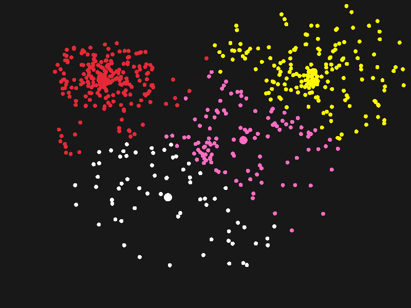

# k-means-clustering-in-c

K-means clustering algorithm divides the n set of observations into K clusters. It is one of the most useful algorithm used in Data Mining and Machine Learning. This is the C Program to visualize the algorithm using raylib.

References: https://en.wikipedia.org/wiki/K-means_clustering
Raylib: https://www.raylib.com/

# Output:
Here is the output:

